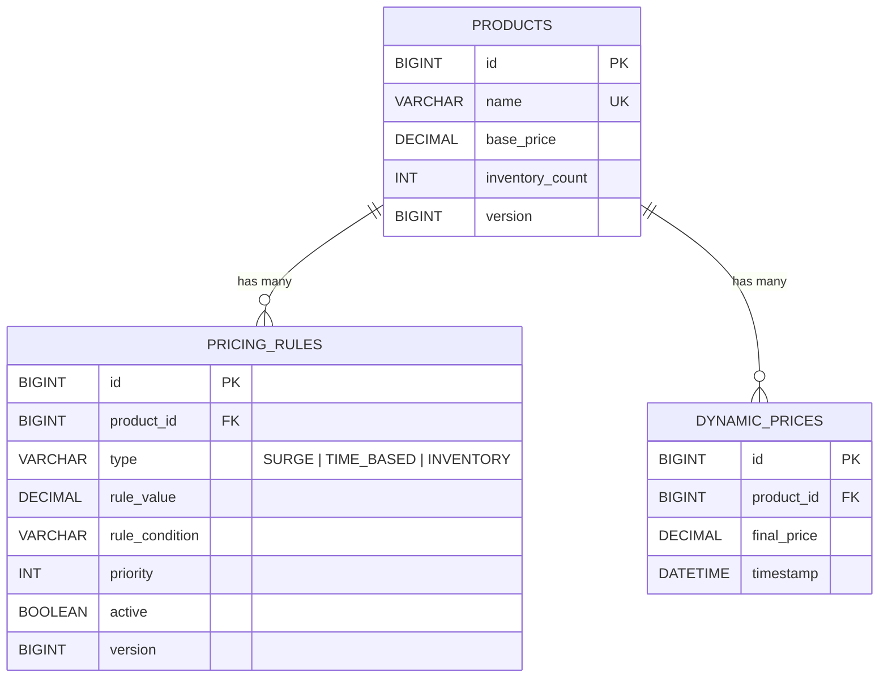

# Dynamic Pricing Engine — ER Diagram

GitHub renders Mermaid diagrams natively in Markdown, so this will show up
as a visual diagram directly on the repo page — no extra tooling needed.

## Notes

- **products.name** has a uniqueness constraint enforced at the application
  layer (`ProductRepository.existsByNameIgnoreCase`), not a DB-level
  `UNIQUE` index — add one via a migration if you want DB-level enforcement
  too.
- **pricing_rules.rule_value** / **rule_condition** are named with a
  `rule_` prefix (not `value` / `condition`) because those are reserved
  words in several SQL dialects (MySQL, H2); using them as bare column
  names causes `CREATE TABLE` to fail silently on some engines.
- **pricing_rules.product_id** and **dynamic_prices.product_id** are both
  foreign keys back to `products.id`; `dynamic_prices` has no FK constraint
  in the current schema (it's an append-only audit log, not managed via
  JPA cascade) — add one if strict referential integrity is required.
- **version** columns on `products` and `pricing_rules` back optimistic
  locking (`@Version` in JPA), not application data — they're not meant to
  be edited directly.
